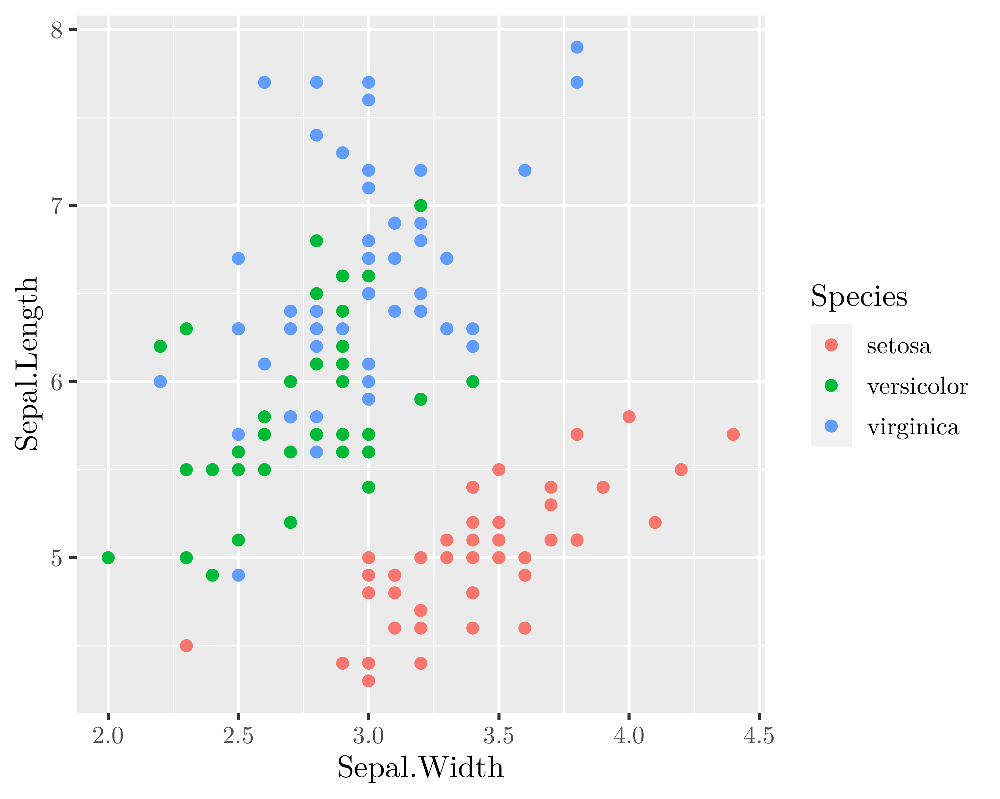
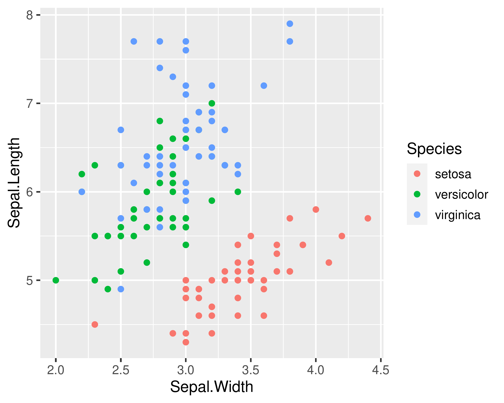

<!-- README.md is generated from README.Rmd. Please edit that file -->

# plottr

<!-- badges: start -->
<!-- badges: end -->

The goal of plottr is to …

## Installation

You can install the development version of plottr from
[GitHub](https://github.com/) with:

``` r
# install.packages("remotes")
remotes::install_github("m-pilarski/plottr")
```

## Example

This is a basic example which shows you how to solve a common problem:

``` r
library(plottr)
library(ggplot2)

iris_plot <- iris |> 
  ggplot(aes(x=Sepal.Width, y=Sepal.Length, color=Species)) + 
  geom_point()

plot_to_file(
  .plot_obj=iris_plot, .plot_name="iris_plot_1", 
  .figure_dir="man/figures/README-plot_to_file", 
  .width=125, .height=100, .knit=TRUE
)
```



``` r
plot_to_file(
  .plot_obj=iris_plot, .plot_name="iris_plot_2", 
  .figure_dir="man/figures/README-plot_to_file", 
  .fonts=list(main="Nimbus Sans"),
  .width=125, .height=100, .knit=TRUE
)
```



``` r
fs::dir_ls("man/figures/README-plot_to_file")
#> man/figures/README-plot_to_file/iris_plot_1.pdf
#> man/figures/README-plot_to_file/iris_plot_1.png
#> man/figures/README-plot_to_file/iris_plot_2.pdf
#> man/figures/README-plot_to_file/iris_plot_2.png
```
